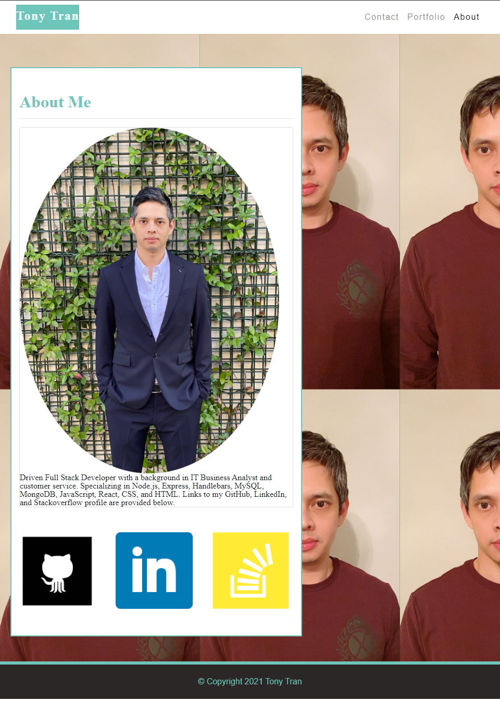

# Tony Tran - My Portfolio
This is my portfolio project that was initially built using Bootstrap. This portfolio will be updated to be using Zurb Foundation framework. 

## Description

My portfolio will be updated as I progress through my journey as a web developer. This page was built using Bootstrap, HTML, and CSS. The page is compliance with accessibility standards was designed with responsive mobile design in mind. 

Here is the link to the deployed project. 

<https://code-monkey713.github.io/boot-about-me/>

If you want to contact me, please feel free to use the contact page for my info. 

## Installation

There is no special installation instructions. 

## Usage

The links for all the portfolio items will be on the portfolio page. Screenshot provided below.

## Credits

Here are the references used to make this project. 

References:
  - https://get.foundation/frameworks-docs.html
  - https://getbootstrap.com/docs/5.0/getting-started/introduction/

## License

MIT
