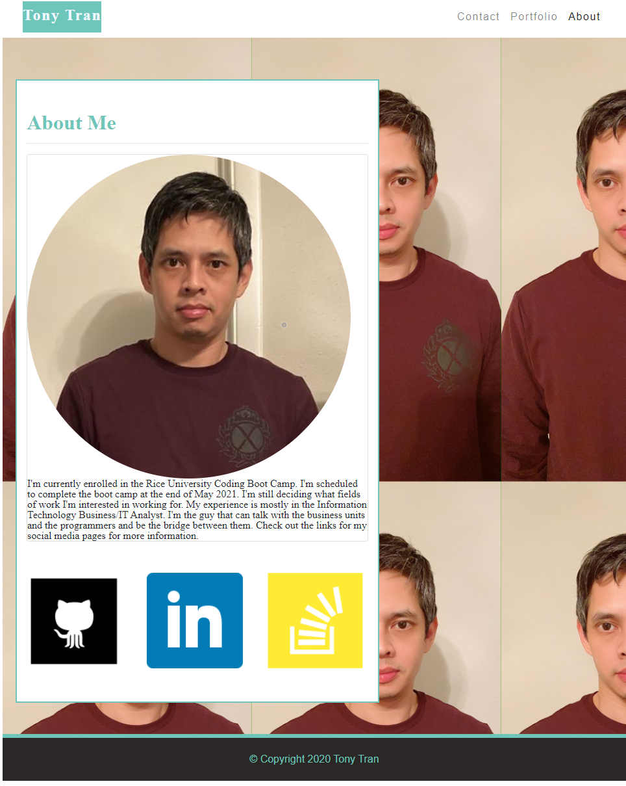

# Tony Tran - My Portfolio
This is the project for using Bootstrap to build my portfolio page to be ready for employement ready. 

## Description

We were taught with using Bootstrap for building a website from scratch using HTML, CSS and Bootstrap libraries. The page is compliance with accessibility standards. The page was designed with responsive design in mind built from mobile first design. 

This portfolio is currently work in progress as contents will be updated and added with my continued education with Rice University. 

Here is a link to the deployed project. 

<https://code-monkey713.github.io/boot-about-me/>

## Installation

For this project, you can visit the site to view the content. You can inspect the page for the codes. 

## Usage
Please follow the link to go to the portfolio. Screenshot provided below.

## Credits

I would like to give credit to my instructor Tish McNeel for some wonderful tutorials for HTML, CSS, and Bootstrap to help me complete this portfolio. 

## License

There is no license for this project. 
