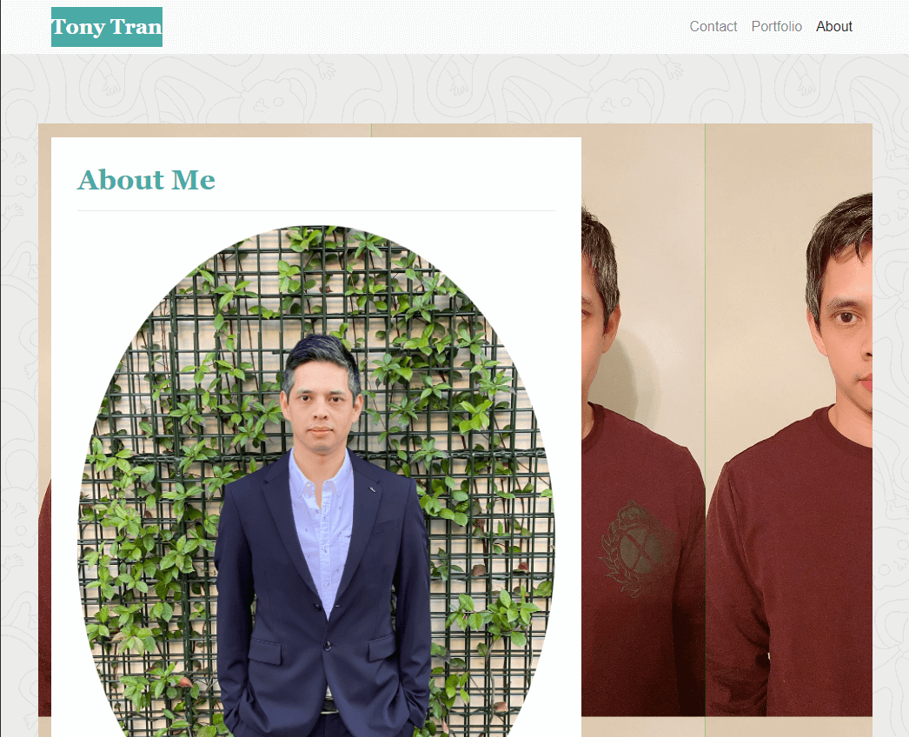

# Tony Tran - My Bootstrap Portfolio
License: 
Tech Stack:   

Welcome to my portfolio website built using Bootstrap from the ground up. The application is deployed to Netlify. The form on contact page for submission is setup. I will get all submission of information sent. 

## Description

This portfolio will not be updated because I'm in the middle of updating my portfolio to React.JS. This page was built using Bootstrap, HTML, and CSS. The page is compliance with accessibility standards was designed with responsive mobile design in mind. 

## Table of Contents

* [Installation](#installation)
* [Usage](#usage)
* [License](#license)
* [Contributing](#contributing)
* [Tests](#tests)
* [Questions](#questions)
* [References](#references)

## Installation

For this project, you can visit the site to view the content. You can inspect the page for the codes. 

## Usage

Here is a link to the deployed project. 

<https://boot-about-me.netlify.app/>

## License

MIT

## Contributing

If you would like to contribute to this project, you can fork a copy of the repo and make changes or improvements on your repo. Once ready, you can request a push and I will review the changes before updating the repo. 

## Tests

There are no tests with this application. Let me know if you are interested in creating a test for this application. 

## Questions

If you have any questions, feel free to contact me directly and listed below are my contact informations. 

GitHub profile: code-monkey713

Email: tony.tran713@outlook.com

## References

  - https://getbootstrap.com/docs/4.6/getting-started/introduction/
